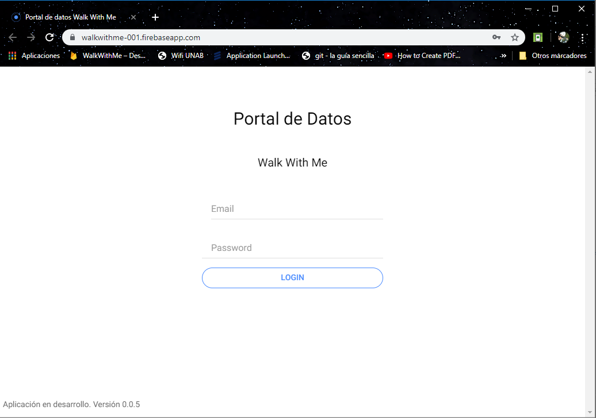
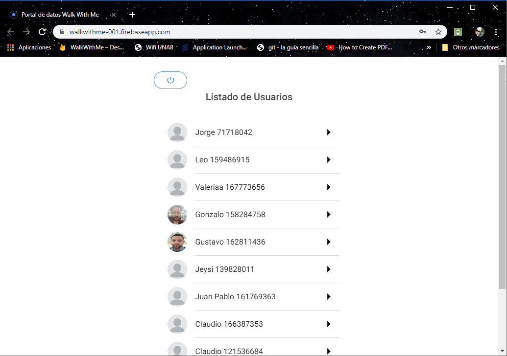
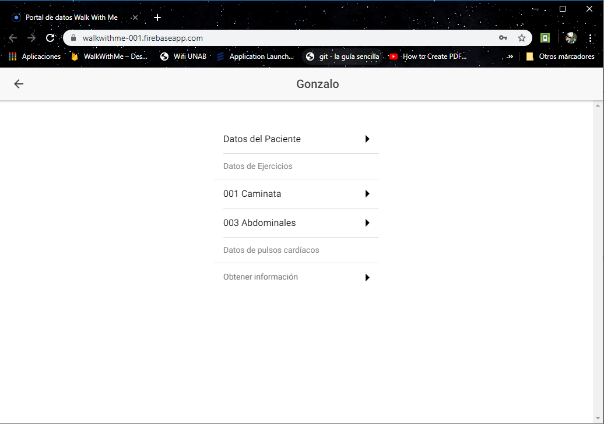
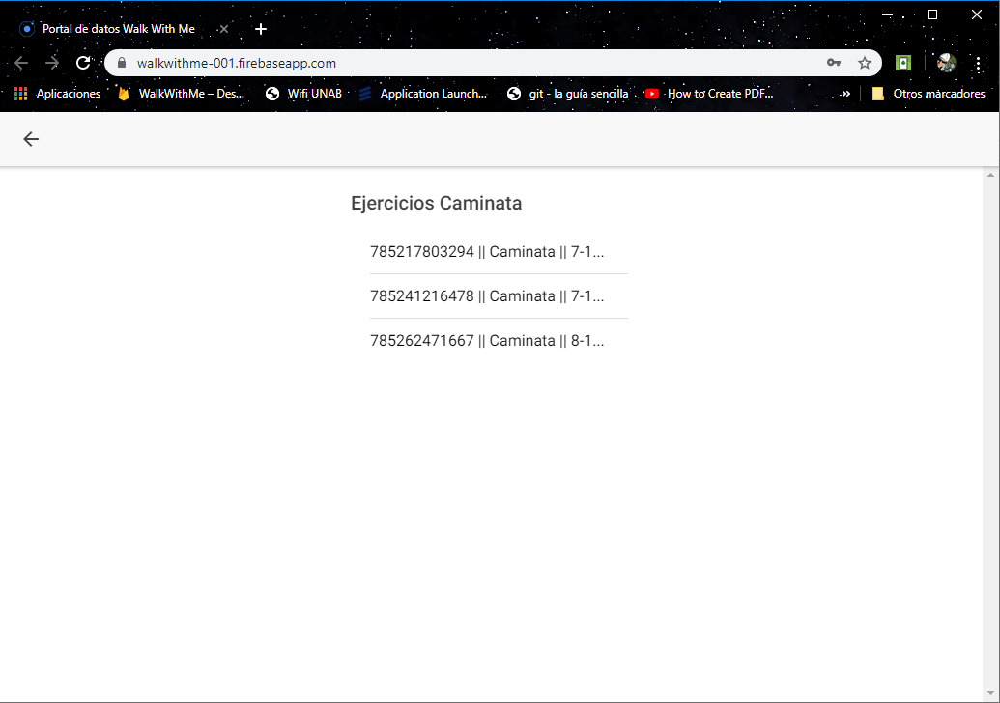

<article>
    <h1>Descarga datos obtenidos desde la app Android Exercise With Me</h1>
    
    <h2>versión 0.0.5</h2>
    <h2>Detalles</h2>
    
La aplicación está construida desde el entorno de 
        Ionic en su versión 3.9.2.

    
Es posible ser ejecutada tambien desde la dirección web 
        <a href="https://walkwithme-001.firebaseapp.com/">
            https://walkwithme-001.firebaseapp.com/
        </a> y <a href="https://walkwithme-001.web.app/">
            https://walkwithme-001.web.app/
        </a> donde se envían todas las actualizaciones del desarrollo.
    

    <h3>Instalation Notes (Developer)</h3>
    <h4>Si no cuentas con el framework, instala Ionic v 3.9.2</h4>
    <code>npm install -g ionic@3.9.2 cordova@7.1.0</code>
    <h4>Descarga desde Github</h4>
    <code>git clone https://github.com/GonzaloUNAB2018/wwm_portal_web</code>
    <h4>Ingresa a carpeta WalkWithMe</h4>
    <code>cd wwm_portal_web</code>
    <h4>Instala dependencias</h4>
    <code>npm -i</code>
    <h4>Corre la aplicación</h4>
    <code>ionic serve</code>
    <h3>Uso y credenciales</h3>
    
Su uso es exclusivo para investigación en Tesis, para la Universidad Andrés Bello,
        sede Viña del Mar.
    

    
Quienes no hayan recibido directamente las credenciales de ingreso, solicitarlas a 
        <a href="mailto:g.orellanacanales@uandresbello.edu">g.orellanacanales@uandresbello.edu</a>.

    <h3>User Manual</h3>
    
Busque en el navegador la URL <a href="https://walkwithme-001.firebaseapp.com/">
        https://walkwithme-001.firebaseapp.com/
    </a> o al <a href="https://walkwithme-001.web.app/">
            https://walkwithme-001.web.app/
    </a> y abra la página web. n ella agregue las credenciales.

    
    
Elija una de las personas que están en la lista.

    
Cada lista está indicado el Nombre y el RUN con dígito verificador.

    
    
Abrirá un listado donde puede elegir entre ver los datos del usuario, los ejercicios realizados y el acceso a registro de pulsaciones cardiacas.

    
    
Elija el ejercicio que desea revisar.

    
    
Se desplegará el listado de datos que busca

    
    
Para descargar los datos en formato CSV, solo presione "EXPORT TO CSV"

    
    
Se descargará un archivo que tiene la siguiente nomenclatura en el nombre:

    
"Tipo de ejercicio"_"NickName"_"RUN"_"Fecha de hoy"_"Hora de descarga"

    
    
Abra el archivo como documento de Excel para ver el resultado.

    
</article>